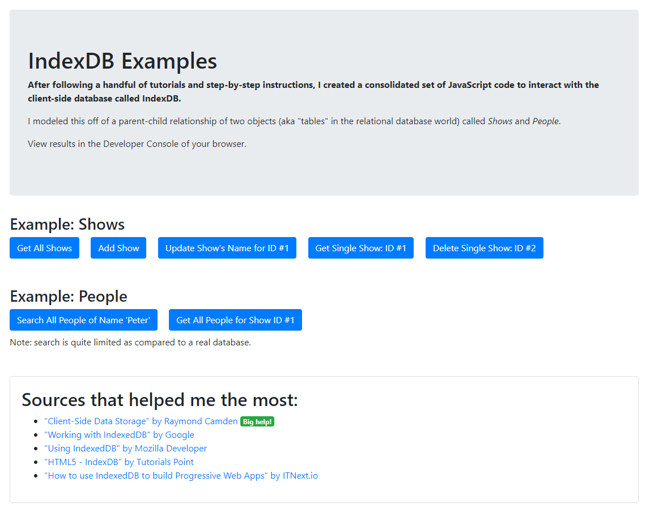

## Consolidated common functionality for IndexedDB

After following a handful of tutorials and step-by-step instructions, I created a consolidated set of JavaScript code to interact with the client-side database called IndexDB.

I modeled this off of a parent-child relationship of two objects (aka "tables" in the relational database world) called Shows and People.

View results in the Developer Console of your browser.

[View Demo](https://stevesohcot.github.io/indexeddb/)